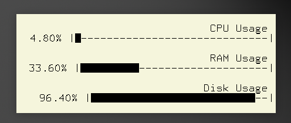
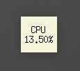

# Tkinter Desktop Widgets (pyw)

This project includes simple Tkinter desktop widgets: a Wiki article of the day widget and resource monitoring widgets. The widgets are implemented as `.pyw` files to run without a terminal.

## Features

- **Wiki Article of the Day**: Displays the Wikipedia article of the day.
- **Resource Monitoring**: Monitors and displays system resources such as CPU and memory usage.

## Screenshots

### Wiki Article of the Day


### Resource Monitoring


### Additional Screenshots

<p align="center">
    
    
    
</p>

## Usage

Once the widgets are running, you can drag them anywhere on the screen. Features include:

- **Right-click to Refresh**: Right-click on the widget to refresh its content.
- **Adjust Size**: You can adjust the size of the widgets to small, medium, or large.
- **Settings File**: The widgets include a settings file where you can customize various parameters. Below is a snippet of some settings:

    ```json
    {
        "Global": {
            "x": 1478,
            "y": 355,
            "size": 1.2,
            "topmost": "True",
            "text_color": "black",
            "bg_color": "beige",
            "opacity": "0.8"
        },
        "ResourceMonitor": {
            "x": 1443,
            "y": 186,
            "size": 1.3,
            "topmost": "False"
        },
        "Cpu": {
            "x": 1522,
            "y": 59,
            "size": 1.3,
            "topmost": "True"
        }
    ...
    ```

## Setup

1. Clone the repository


2. Navigate to the app directory:
    ```bash
    cd Tkinter-Desktop-Widgets-py-
    cd app
    ```

3. Install the required packages:
    ```bash
    pip install -r requirements.txt
    ```
